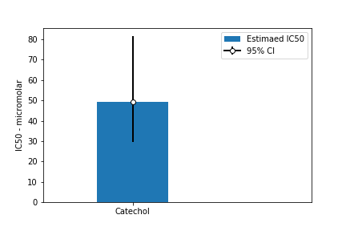

# mmpbsa_from_openmm
example demonstrating a free energy estimate starting from OpenFoceField-parameterized ligands and using an OpenMM-derived
trajectory. 

# file prep:
see files in `openmm_simulation` dir.

- [x] process the PDB file with openmm-setup (1XEP - catechol bound to T4 lysozyme)
- [x] in `align_ligand.ipynb`, generate an RDKit `mol` object that is aligned
with the crystal structure ligand
- [x] in `parameterize_ligand.ipynb`, use OpenForceField to parameterize this `mol`
object 
- [x] in `combine_systems.ipynb`, add the parameterized ligand to the system and save a copy as `*.parm7`

You now have a `.parm7` file called `complex_plus_water.parm7`. There will also be `complex_system.xml`,
which is an openmm `System` object that can be fed into a `Simulation` to make a trajectory.
Thus we have the building blocks for an MMPBSA run using CaFE in VMD/NAMD2.

# generate a trajectory

- [x] in the topmost directory, see `generate_trajectory.ipynb` to generate a 5ns trajectory using OpenMM

# analyse

- [x] run VMD script (`vmd -dispdev text < analyse.tcl > out.log`), having installed APBS, NAMD2
and CaFE plugin (~40mins)

# results

The free energy estimate was -6.1105 kcal/mol with SD 2.5155. By my calculations that's an IC50
of around 50 micromolar. The errorbars are unequal because I am assuming the error is normally
distributed around the mean affinity value, which gets distorted when exponentiated to get IC50. This is
at least an order of magnitude off, if you consider catechol has low millimolar or high micromolar
binding affinity (see Mobley, Chodera, Dill 10.1063/1.2221683).

Crystal structures of catechol bound to T4 lysozyme show two possible binding modes, so correctly
sampling these might improve the calculation (https://doi.org/10.1021/jm0491187). Also, I assumed 250 statistically
independent samples and only sampled for a small time (5ns). It may be safer to do some block averaging
here, or increase the time between
samples (i.e. the DCD stride), since 20ps between samples
doesn't sound like enough to decorrelate. Ultimately, though, MMPBSA is an approximate method so we don't expect
to be super close to the absolute values. Instead, it is more applicable to relative affinity calculations (not shown here).

Assuming a true 1uM binding affinity, current estimate is about 1.8kcal/mol too high. 

# tidbits

- CaFE can be installed by cloning the CaFE repo at https://github.com/HuiLiuCode/CaFE_Plugin,
then changing the name of the `src` dir within to `cafe1.0`. To let VMD know where this directory is,
add this line to your ~/.vmdrc file (change the actual filepath to your own computer):
`set auto_path [linsert $auto_path 0 {/home/lewis/Documents/cafe/cafe1.0}]`
- Test if CaFE runs by opening vmd and typing `package require cafe 1.0`
- You will need to install `APBS` and add it to the PATH so it can be called from within CaFE
- APBS is offered as a binary and, to run it, you will need to add the `lib` dir within the APBS
directory to the LD_LIBRARY_PATH as well
- Likewise you need to install `namd2` and add it to the PATH
- CaFE script uses the defaults from the manual. Up to you whether that applies in every case.
- APBS takes a long time to run even with 8CPUs. 250 frames took 40 minutes.
